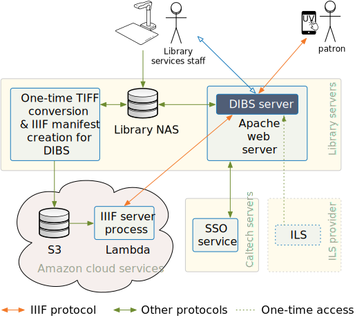

# System architecture

This page describes the goals, design, and operation of DIBS.

## Design goals

DIBS ("_**Di**gital **B**orrowing **S**ystem_") is intended to be a basic, standalone, [controlled digital lending](https://controlleddigitallending.org) system with the following goals:

* _Simplicity_. We wanted to keep everything as simple as we could -- simple user interfaces, simple internal logic, simple installation. This supported rapid development and deployment, and going forward, it will help continued maintenance and evolution.
* _Patron privacy_. In designing DIBS, we sought to minimize the amount of patron data requested and stored, to maintain patron privacy and reduce the impact of potential data leaks. DIBS does not store any patron information when a loan is not active, and during a loan, it stores only the user's institutional SSO identity combined with the (single) barcode they have on loan during the loan period. There are no provisions in the software for retaining the information past the loan period, or tracking identities or loan statistics based on user identities.
* _Single sign-on integration_. DIBS doesn't implement logins, and instead relies on an institutional single sign-on system to provide authentication. This simultaneously avoids having to implement user account logins and other complex, error-prone elements in DIBS itself, and makes the user experience consistent with other institutional software systems.
* _Independence_. The system is deliberately not integrated tightly with an ILS.  The current interface to Caltech's TIND ILS is limited to a very small section of code in the server, and the item metadata fields needed by DIBS are very basic: a barcode, a title, an author list, a year, and a couple of others.  There is zero dependence on data formats, too -- no XML, no MARC, nothing. This should make it possible to replace the TIND-specific code with an interface to another ILS without great difficulty.
* _Use of IIIF_. We chose IIIF because it is a highly flexible, widely-used, open standard for serving content, and there are many free and excellent resources for working with it (including servers and alternative viewers).


## Architectural overview

The following diagram illustrates the components of a complete CDL system using DIBS, as it is deployed at Caltech.

<figure>
    
</figure>


## Basic workflow for adding items

DIBS does not rely on any particular workflow or system to create IIIF-compliant materials.  It only needs a IIIF manifest for each item that is to be made available for digital loans, and a IIIF server endpoint.  Nevertheless, to help understand the overall system, here is a summary of the process used by the Caltech Library.

For any given item made available via DIBS, Library staff first scan the pages of the item and store the images on an internal file server at Caltech.  The pages are stored in a directory named after the item's barcode.  Once all the pages have been scanned, the staff doing the scanning notify the maintainers of DIBS, who then run a [script written in Python](https://github.com/caltechlibrary/dibs-scripts). This script converts the scanned document images into a IIIF-compliant format, and also creates a [IIIF](https://iiif.io) manifest.  The script copies the IIIF images to a location where our IIIF server will find them (at the time of this writing, an Amazon S3 bucket), and also copies the manifest to a directory on the server running DIBS. The manifest is given a file name with the pattern <i><code>barcode</code></i><code>-manifest.json</code>, where <i><code>barcode</code></i> is the item's barcode. Thereafter, DIBS knows how to serve the content for the item identified by that barcode.

<!--
## Database

The definition of the database is in [`dibs/database.py`](../dibs/database.py).  The interface is defined in terms of high-level objects that are backed by an SQLite database back-end.  The ORM used is [Peewee](http://docs.peewee-orm.com/en/latest/).

Worth knowing: Peewee queries are lazy-executed: they return iterators that must be accessed before the query is actually executed.  Thus, when selecting items, the following returns a Peewee `ModelSelector`, and not a single result or a list of results:

```python
Item.select().where(Item.barcode == barcode)
```

and you can't call something like Python's `next(...)` on this because it's an iterator and not a generator.  You have to either use a `for` loop, or create a list from the above before you can do much with it.  Creating lists in these cases would be inefficient, but we have so few items to deal with that it's not a concern currently.


## Server

## Endpoints

The definition of the service endpoints and the behaviors is in [`dibs/server.py`](../dibs/server.py).  The endpoints are implemented using [Bottle](https://bottlepy.org).  Here is a summary of the endpoints implemented by the system:

| Endpoint                 | Type | Purpose              |
|--------------------------|------|----------------------|
| `/`                      | GET  | General information page about the system |
| `/info`                  | GET  | Same as `/` |
| `/login`                 | GET  | Shows the login page |
| `/login`                 | POST | Accepts form from login page |
| `/logout`                | GET  | Logs out current user |
| `/list`                  | GET  | Show what's available for loan |
| `/add`                   | GET  | Show the page to add an item |
| `/edit/<barcode>`        | GET  | Show the page to edit an item |
| `/update/add`            | POST | Accepts form input from add-item page |
| `/update/edit`           | POST | Accepts form input from edit-item page | 
| `/ready`                 | POST | Handles checkbox in `list` page to make an item ready to loan |
| `/remove`                | POST | Handles button in `list` page to remove an item |
| `/item/<barcode>`        | GET  | Shows item information page for a given item |
| `/loan`                  | POST | Handles Loan button from `/item` page |
| `/view/<barcode>`        | GET  | Show the item in the viewer page |
| `/return/<barcode>`      | GET  | Handles Return button from viewer page |
| `/manifests/<barcode>`   | GET  | Sends manifest to viewer |
| `/thankyou`              | GET  | Destination after user uses Return button |
| `/notauthenticated`      | GET  | Error page for unathenticated users |
| `/nonexistent`           | GET  | Error page for nonexistent items |
| `/nonexistent/<barcode>` | GET  | Error page for nonexistent items |


## Architectural notes

### _About Peewee_

The definition of the database is in [`dibs/database.py`](dibs/database.py).  The interface is defined in terms of high-level objects that are backed by an SQLite database back-end.  The ORM used is [Peewee](http://docs.peewee-orm.com/en/latest/).

Worth knowing: Peewee queries are lazy-executed: they return iterators that must be accessed before the query is actually executed.  Thus, when selecting items, the following returns a Peewee `ModelSelector`, and not a single result or a list of results:

```python
Item.select().where(Item.barcode == barcode)
```

and you can't call something like Python's `next(...)` on this because it's an iterator and not a generator.  You have to either use a `for` loop, or create a list from the above before you can do much with it.  Creating lists in these cases would be inefficient, but we have so few items to deal with that it's not a concern currently.


### _About Bottle_

The definition of the service endpoints and the behaviors is in [`dibs/server.py`](dibs/server.py).  The endpoints are implemented using [Bottle](https://bottlepy.org).

The web server used at the moment is the development server provided by Bottle.  It has live reload built-in, meaning that changes to the `.py` files are picked up automatically and the server updates its behavior on the fly.

See http://bottlepy.org/docs/dev/tutorial.html#auto-reloading for an important note about Bottle: when it's running in auto-reload mode, _"the main process will not start a server, but spawn a new child process using the same command line arguments used to start the main process. All module-level code is executed at least twice"_.  This means some care is needed in how the top-level code is written.  Useful to know is that code can distinguish whether it's in the parent or child process by looking for the presence of the environment variable `'BOTTLE_CHILD'` set by Bottle in the child process.

-->
