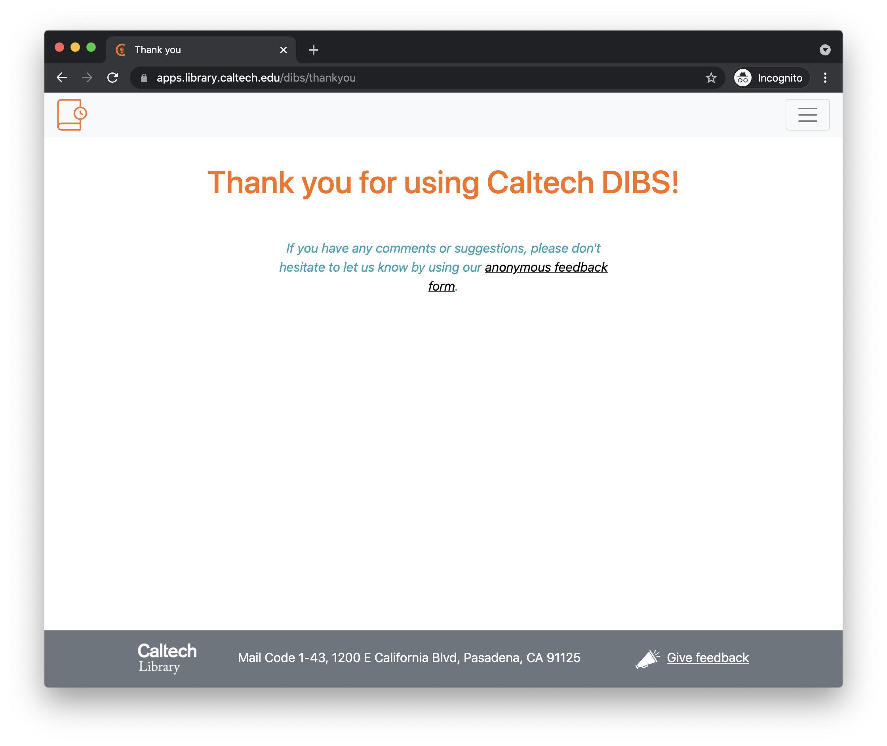

# Using DIBS

This page describes how DIBS works from the users' standpoint.  A separate section in this document describes the [system architecture](architecture.html#architecture--page-root) that implements the functionality described here.

## Guiding assumptions

The current design of DIBS is focused on helping instructors and students enrolled in classes.  DIBS provides fairly distinct experiences for patrons on the one hand, and staff on the other; this separation is due to expectations about how different classes of users will interact with the system:

1. We expect patrons to be mainly students enrolled in educational courses at Caltech.  We expect that patrons looking for materials to borrow will be informed about the availability of specific items via course syllabi or similar resources produced by course instructors.  Consequently, DIBS does not currently expose to patrons a catalog of "all things available for digital loan via DIBS"; in part, this is because such a list was not considered to be useful for DIBS's use-cases, and in part because in the future we expect to add links directly to Caltech's TIND database.
2. We expect that library staff need to interact with the system in a quite different way: to add new items to the database of digitized works and control loan parameters.  Thus, staff _do_ see a list of all items available through the system, but access to this list is limited to Library staff.

These considerations explain the front page of DIBS, which (perhaps contrary to expectations), lacks a login interface or a list of titles available in the system.  The front page acts mainly as an information page that describes the purpose of the system and the policies:

<figure>
    
</figure>

## The patron experience

As mentioned above, patrons are presumed to be provided information about specific items available for loan.  The working assumption is that they will be given URLs that take them directly to item description pages in DIBS.  An example of an item description page is shown below:

<figure>
    
</figure>

The item description page provides basic information about a particular title available through DIBS, along with a button to request a digital loan.  The information about the title is derived from Caltech's TIND server based on the barcode used by Library staff when they add the item to DIBS. (The thumbnail image is obtained from either Amazon or Google using the item's ISBN, if it has one; otherwise, a blank is shown instead.)

The text and button shown in the lower half of the page change based on the current availability of the item. The page will show a  Get loan button if the item is available for loan at that time.  If the item is not available to the patron, the button changes to Not available, and in addition, the text above the button provides information about why it is not available and when it will be available again:

<figure>
    
</figure>

If the item is available to the user, and they click the Get loan button, then they will be presented with a brief confirmation dialog.  If they elect to proceed, a loan will be started immediately and they will be transferred to the viewer.

<figure>
    
</figure>

DIBS uses [Universal Viewer](https://universalviewer.io) for this purpose; UV is an open-source browser-based media viewer that works with content described in [IIIF](https://iiif.io/community/faq/) format.  The loan has a limited time duration; the end time is shown in the upper left portion of the viewer screen.  

The patron can elect to end the loan early.  If they do, the viewer will close and they will be presented with a thank-you page that also includes a link to a feedback page:

<figure>
    
</figure>

## The staff experience

The current development version of DIBS does not yet integrate with Caltech's SSO for authentication, and consequently, DIBS has its own login mechanism for demonstration purposes.  The login page is accessible from the drop-down menu in the upper right-hand corner of every page in DIBS:

<figure>
    
</figure>

Selecting the **Staff login** option from the menu redirects the user to the login page:

<figure>
    
</figure>

Staff users can log in with their email address.  Once logged in, staff are redirected to the main entry point for staff, which is the list page located at `/list`:

<figure>
    
</figure>

As its name implies, the list page provides a list all of the items known to DIBS (whether they are ready to be available for digital loans or not), and allows staff to add, edit, or remove items.  It is also the place where staff can get the link to be distributed to patrons to request loans.  In more detail:

* **Barcode**: the barcode identifying the item in the Caltech Library.
* **Title**: the title of the item. This is entered free-form in the DIBS entry form and does not have to match the actual title in Caltech's TIND database.
* **Author**: the author of the item. This is entered free-form in the DIBS entry form and does not have to match the actual author in Caltech's TIND database.
* **Ready to loan?**: when unchecked, the item is not made available for digital loans. This allows staff who scan the items to start making an entry in DIBS and continue scanning. When done, staff can check the "Ready to loan?" checkbox and make it available to digital patrons.
* **Loan duration**: the duration of a loan. The system automatically closes the loan after the loan period and blocks the patron's access. (Patrons can also close loans early if they wish.)
* **Copies for loans**: how many copies of the item are being made available for simultaneous borrowing?
* **Copies in use**: indicates the number of copies of the item on loan at the moment.
* Copy link: this copies to the user's clipboard a link to the item loan page.  This is what should be communicated to course instructors, so that they can pass on the URLs to their students.
* Edit: edit the entry. This brings up the same form as is used to add new entries, but with the values filled in, allowing the user to change the values and save the results.
* Remove: remove the entry for the item in the DIBS database. This does not remove the scans or other files, only the database entry.

If the user clicks the Add a new item button, they are presented with the following screen:

<figure>
    
</figure>

Here, information can be entered to describe a new item being made available for digital loans.  All of the information about a given item is based on the barcode; this barcode is used to look up the item in Caltech's TIND server, and the information extracted from TIND is used to populate the item view page discussed in the previous section.
