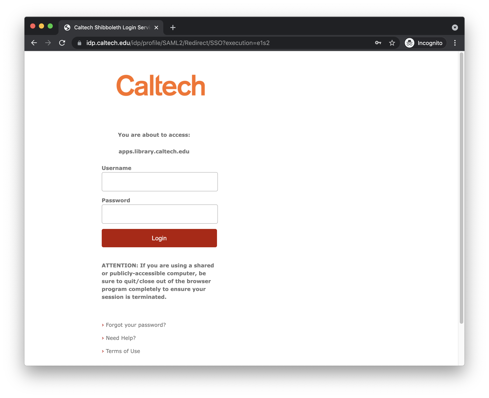
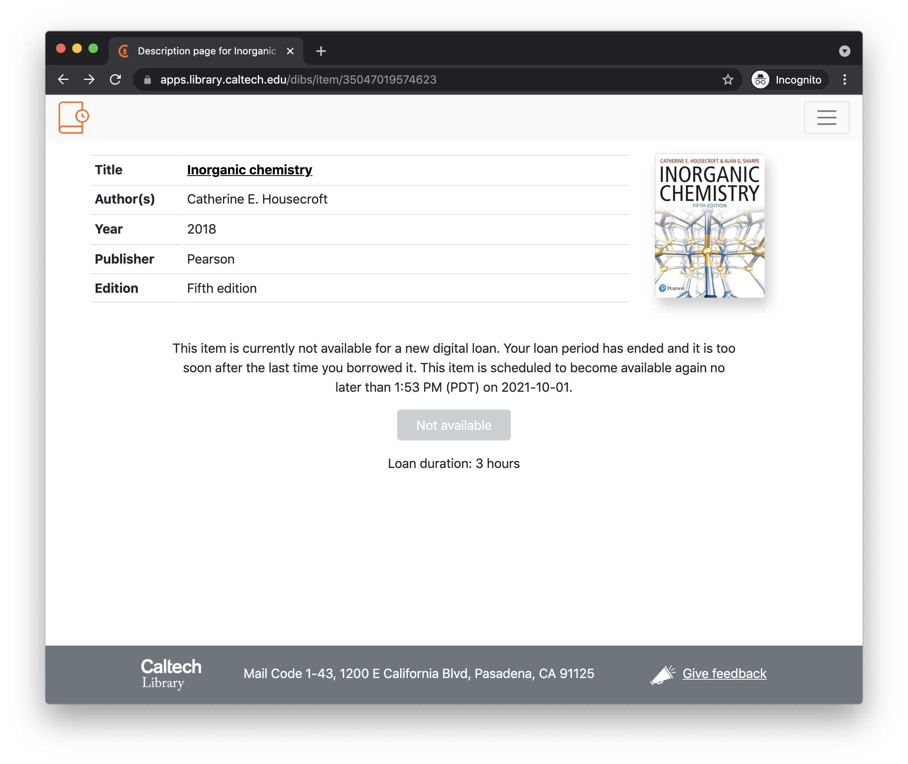
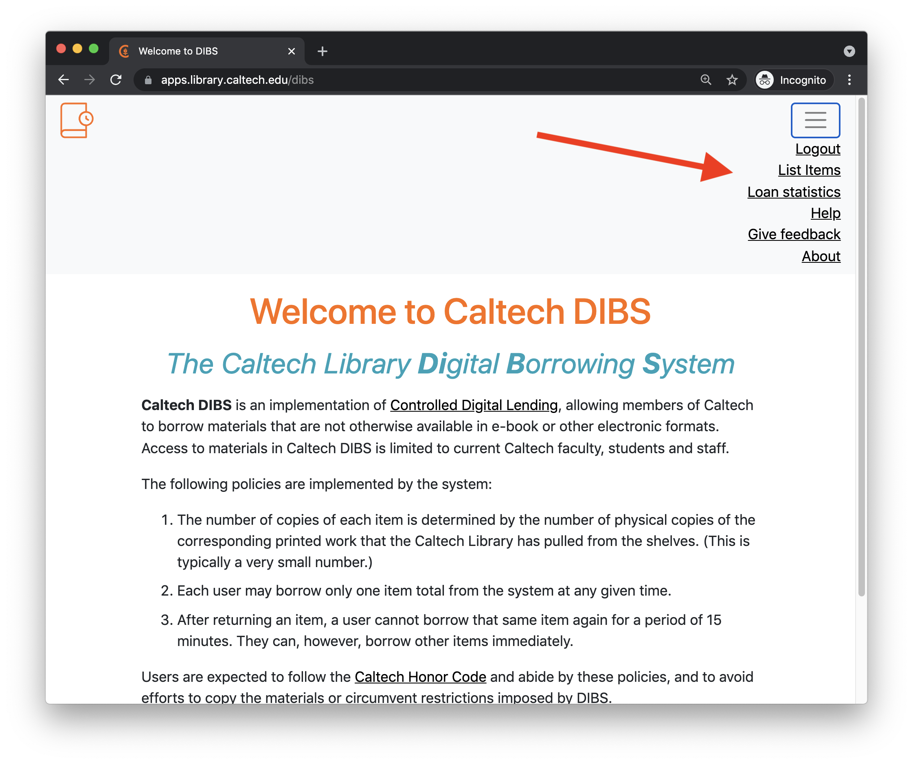

# Using DIBS

This page describes how DIBS works from the users' standpoint.  A separate section in this document describes the [system architecture](architecture.html#architecture--page-root) that implements the functionality described here.


## Authentication

Authentication is assumed to be handled by the system hosting DIBS. In Caltech's case, we use [Shibboleth](https://en.wikipedia.org/wiki/Shibboleth_Single_Sign-on_architecture), an institute-wide, single sign-on system for authentication. This means is that a sign-in page is presented before users ever reach DIBS, by an authentication layer implemented by the web server. The screenshot below shows an example of this:

<figure>
    
</figure>

DIBS itself does not do anything beyond distinguishing between regular users and those who have staff privileges (discussed below).


## Front page

The current design of DIBS is focused on helping instructors and students enrolled in classes.  DIBS provides fairly distinct experiences for patrons on the one hand, and staff on the other; this separation is due to expectations about how different classes of users will interact with the system:

1. We expect that patrons will be informed about the availability of specific items via course syllabi or similar resources produced by course instructors.  Consequently, DIBS does not currently expose to patrons a separate index of "all things available for digital loan". In part, this is because we expect patrons will be directly informed about the pages describing individual items, and in part because we anticipate that in the future we will add DIBS links directly to Caltech's [TIND](https://info.tind.io/ils)-based catalog.

2. We expect that library staff need to interact with the system in a substantially _different_ way: not to read the materials, but to manage the items in the database of digitized works and control loan parameters.  Thus, staff _do_ see a list of all items available through the system, but access to this list is limited to Library staff.

These considerations explain the front page of DIBS, which (perhaps contrary to expectations) lacks a login/sign-in interface or a list of items.  This is because in normal use, we expect that users will go straight either to a page describing an individual item or to a DIBS management page.  The front page acts mainly as an information page that describes the purpose of the system and the loan policies:

<figure>
    
</figure>


## The patron experience

As mentioned above, patrons are assumed to be provided information about specific items available for loan.  The working assumption is that they will be given URLs that take them directly to item description pages in DIBS.  An example of such an item description page is shown below:

<figure>
    
</figure>

The item description page provides basic information about a particular title available through DIBS, along with a button to request a digital loan.  The information about the title is derived from Caltech's [TIND](https://info.tind.io/ILS) server based on the barcode used by Library staff when they add the item to DIBS. 

The text and button shown in the lower half of the page change based on the current availability of the item. The page will show a  <span class="button color-primary">Get loan</span> button if the item is available for loan at that time.  If the item is not available to the patron, the button changes to <span class="button color-not-available">Not available</span>, and in addition, the text above the button provides information about why it is not available and when it will be available again:

<figure>
    
</figure>

If the item is available to the user, and they click the <span class="button color-primary">Get loan</span> button, then they will be presented with a brief confirmation dialog.  If they elect to proceed, a loan will be started immediately and they will be transferred to the viewer.

<figure>
    
</figure>

DIBS uses the [Universal Viewer (UV)](https://universalviewer.io), an open-source browser-based media viewer that works with content described in [IIIF](https://iiif.io/community/faq/) format.  The loan is issued for a limited time, and the end time is shown in the upper left portion of the viewer screen. (The information about the loan duration and the URL for the viewer page are also sent separately via email to the patron, in case they lose it or want to view the content from a different device.)

The patron can elect to end the loan early.  If they do, the viewer will close and they will be presented with a thank-you page that also includes a link to a feedback page:

<figure>
    
</figure>

In designing DIBS, we sought to minimize the amount of patron data requested and stored, to maintain patron privacy and reduce the impact of potential data leaks.  DIBS does not store any patron information when a loan is not in effect (after the lock-out period on a title that was just borrowed), and during a loan, it stores only the user's institutional single sign-on (SSO) identity combined with the (single) title they have on loan during the loan period.  There are no provisions in the software for retaining the information past the loan period, or tracking identities or loan statistics based on users.


## The staff experience

Overall, the workflow to add new items to DIBS is simple: staff scan books and store the results in a secure location (one with a shared file system accessible to the DIBS server) and add basic metadata to the DIBS database. Once the item is added to DIBS and flagged as ready to be loaned, a web page for the item allows institutional patrons to request time-limited loans and view the items in the Universal Viewer.  (That is the [patron experience](#the-patron-experience) described in the previous section.)


### How users are identified as staff users

As mentioned at the beginning of this page, users are authenticated by a separate software layer before they can access DIBS, which simplifies DIBS's implementation and reduces what it must do to distinguish different user roles.  By default, every authenticated user is assumed to have basic privileges, so all that is needed is to tell DIBS which users should have staff privileges. DIBS comes with a command-line utility program called [`people-manager`](../people-manager) for that purpose.  For example, to add a user with identity `fakeuser2021@caltech.edu` as a staff user, a system administrator needs to run the following command on the server where DIBS is installed:

```sh
./people-manager add uname="fakeuser2021@caltech.edu" role="library"
```


### Additional pages available to staff users

Users with staff privileges see additional links in the upper-right hand corner menu on every page presented by DIBS. In particular, the menu provides access to the content list and statistics pages, as shown in the screenshot below:

<figure>
    
</figure>


### The list page

Staff are redirected to the main entry point for staff, which is the list page located at `/list`:

<figure>
    
</figure>

As its name implies, the list page provides a list all of the items known to DIBS (whether they are ready to be available for digital loans or not), and allows staff to add, edit, or remove items.  It is also the place where staff can get the link to be distributed to patrons to request loans.  In more detail:

* **Barcode**: the barcode identifying the item in the Caltech Library.
* **Title**: the title of the item. This is entered free-form in the DIBS entry form and does not have to match the actual title in Caltech's TIND database.
* **Author**: the author of the item. This is entered free-form in the DIBS entry form and does not have to match the actual author in Caltech's TIND database.
* **Available to loan?**: when unchecked, the item is not made available for digital loans. This allows staff who scan the items to start making an entry in DIBS and continue scanning. When done, staff can check the "Available to loan?" checkbox and make it available to digital patrons.
* **Loan duration**: the duration of a loan. The system automatically closes the loan after the loan period and blocks the patron's access. (Patrons can also close loans early if they wish.)
* **Copies for loans**: how many copies of the item are being made available for simultaneous borrowing?
* <span class="button color-secondary">Copy link</span>: this copies to the user's clipboard a link to the item loan page.  This is what should be communicated to course instructors, so that they can pass on the URLs to their students.
* <span class="button color-info">Edit entry</span>: edit the entry. This brings up the same form as is used to add new entries, but with the values filled in, allowing the user to change the values and save the results.


### Adding new items

At the bottom of the list page, there are two buttons named <span class="button color-primary">Add new item</span> and  <span class="button color-danger">Manage item list</span>.

<figure>
    
</figure>

If the user clicks the <span class="button color-primary">Add new item</span> button, they are presented with the following screen:

<figure>
    
</figure>

Here, information can be entered to describe a new item being made available for digital loans.  All of the information about a given item is based on the barcode; this barcode is used to look up the item in Caltech's TIND server, and the information extracted from TIND is used to populate the item view page discussed in the previous section.


### Managing items

If the user clicks the <span class="button color-danger">Manage item list</span> button, they are presented with the following screen:

<figure>
    
</figure>

In the current version of DIBS, this page only implements one action. Clicking the <span class="button color-danger">Delist</span> button removes the entry for the item in the DIBS database. (This does not remove the manifest, scans, or other files, only the database entry.) In future versions of DIBS, the management page may include additional operations.


### The stats page

DIBS offers some basic statistics on the _stats_ page:

<figure>
    
</figure>

Any items currently on loan will be shown in bold face in the list. In addition, the page reports three statistics in the last three columns of the table.

* _Total loans to date_: this is a straight count of the number of times the item has been loaned and returned. (Currently on-loan items are not added to the count until they are returned.)

* _Average loan duration_: the mean duration of all loans for the item. If the item has never been borrowed, it is reported as "(never borrowed)", otherwise a duration is given in general human-understandable terms.

* _Content retrievals_: this column contains a small bar graph for each item, expressing the number of page retrievals for that item within the past 15, 30, 45 and 60 minutes.  The counts change over time in a rolling fashion and are recomputed relative to the present time every time the page is refreshed. The values are intended to give a rough sense of the reader activity over the past hour for a given item.
